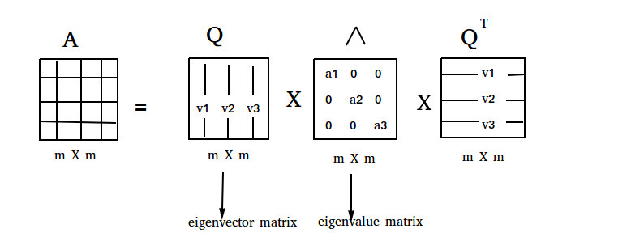
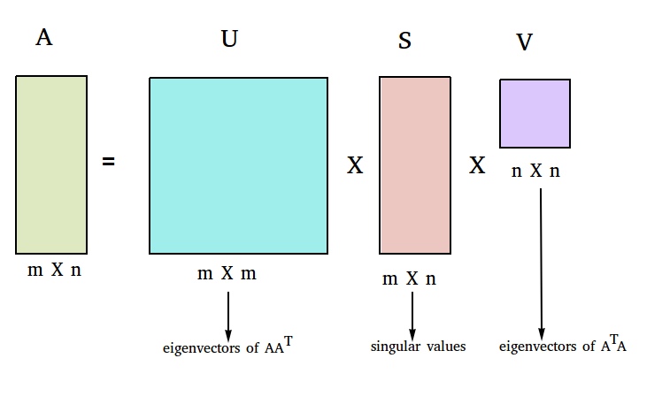
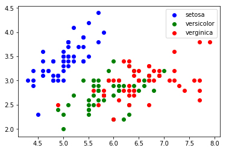
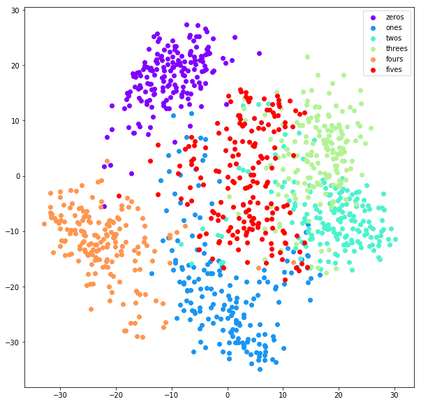

Understanding Dimension Reduction 

[[TOC]]

**NOTE:** notebooks with python and pyspark code are available at: [ [https://github.com/asdspal/dimRed](https://github.com/asdspal/dimRed) ]

# Principal Component Analysis (PCA)

Principal Component Analysis(PCA) is one of the most popular linear dimension reduction. Sometimes, it is used alone and sometimes as a starting solution for other dimension reduction methods. PCA is a projection based method which transforms the data by projecting it onto a set of orthogonal axes.

Let's develop an intuitive understanding of PCA. Suppose, you wish to differentiate between different food items based on their nutritional content. Which variable will be a good choice to differentiate food items? If you choose a variable which varies a lot from one food item to another, you will be able to isolate them properly. Your job will be much harder if the chosen variable is almost same in food items. What if data doesn't have a variable which segregates food items properly? We can create an artificial variable through a linear combination of original variables like

artVar1 = 2 X orgVar1 - 3 X orgVar2 + 5 X orgVar3.

This is what essentially PCA does, it finds best linear combinations of the original variables so that the variance or spread along the new variable is maximum.

Now, let's learn how does PCA achieves the above-mentioned purpose through an animation.

Each blue dot on the plot represents a point from data given by its x & y coordinate. A line P (red line) is drawn from the center of the dataset i.e. from the mean of x & y. Every point on the graph is projected on this line shown by two sets of points red & green. The spread or variance of data along line p is given by the distance between the two big red points. As the line p rotates the distance between the two red points changes according to the angle created by line p with the x-axis. The purple lines which join a point and its projection represent the error which arises when we approximate a point by its projection. PCA creates new variables from old ones. If the new variables closely approximate the old variables, then approximation error should be small. The squared sum of the lengths of all purple lines gives the total error in approximation. The angle which minimizes the squared sum of errors also maximizes the distance between the red points. The direction of maximum spread is called the principal axis. Once we know a principal axis, we subtract the variance along this principal axis to obtain the remaining variance. We apply the same procedure to find the next principal axis from the residual variance. Apart from being the direction of maximum variance, next principal axis must be orthogonal to the other principal axes.

Once, we get all the principal axes, the dataset is projected onto these axes. The columns in the projected or transformed dataset are called principal components.

Luckily, thanks to linear algebra we don't have to sweat much for PCA. Eigenvalue decomposition and Singular value decomposition from linear algebra are the two main procedures used in PCA.

## EigenValue Decomposition, EigenVectors, EigenValue

Eigenvalue decomposition is a matrix factorization algorithm applicable to semi-definite matrix. In the context of PCA, an eigenvector represents a direction or axis and the corresponding eigenvalue represents variance along that eigenvector. Higher the eigenvalue, higher will be the variance along that eigenvector.

The picture above shows the eigenvalue decomposition of a positive definite matrix A. Q is an orthonormal matrix whose columns are eigenvectors and Λ is a diagonal matrix with eigenvalues as the diagonal elements.

## Singular Value Decomposition (SVD)

SVD is a matrix factorization method which expresses a matrix as a linear combination of rank 1 matrices. SVD is more stable than PCA and it doesn't require a positive definite matrix.

As shown in the image SVD produces three matrices U, S & V. U and V orthogonal matrices whose columns represent eigenvectors of AAT and ATA respectively. The matrix S is a diagonal matrix and diagonal values are called singular values. Each singular value is square-root of the corresponding eigenvalue.

How does dimension reduction fit into all this?

Well, once you have calculated eigenvalues and eigenvectors choose the important eigenvectors to form a set of principal axes.

## Selection of EigenVectors

How do we select the number of principal axes to retain? Which principal axes should be selected?

Importance of an eigenvector is measured by the percentage of total variance explained by the corresponding eigenvalue. Suppose V1 & V2 are two eigenvectors with 40% & 10% of total variance along their directions respectively. If asked to choose one from these two eigenvectors, our choice would be V1 because it gives us more information about data.

All eigenvectors are arranged according to their eigenvalues in descending order. Now, we have to decide how many eigenvectors to retain. We will be discussing two methods Total variance explained and Scree Plot for that.

Total Variance Explained

Suppose, we have a vector of n eigenvalues(e0,...,en) sorted in descending order. Take the cumulative sum of eigenvalues at every index until the sum is greater than 95% of the total variance. Reject all eigenvalues and eigenvectors after that index.

Scree Plot

Again, we have to arrange the eigenvalues in descending order. Plot the eigenvalues against its index. 

An ideal scree plot is a steep curve which is followed by a sharp bend and a straight line. Reject all the eigenvalues after the sharp bend and their corresponding eigenvectors. For example in the image shown above sharp bend is at 4. So, the number of principal axes should be 4.

PCA in pyspark

Let's implement the PCA algorithm in pyspark.

Getting familiar with the data.

<pre>
# read the dataset and plot a scatter graph between 1st and 2nd variable
import matplotlib.pyplot as plt
iris = datasets.load_iris()
data = iris.data
target = iris.target
setosa = data[target==0]
versicolor = data[target==1]
verginica = data[target==2]
plt.scatter(setosa[:,0], setosa[:,1], c="b",label="setosa")
plt.scatter(versicolor[:,0], versicolor[:,1], c="g",label="versicolor")
plt.scatter(verginica[:,0], verginica[:,1], c="r",label="verginica") 
</pre>

Convert the numpy array into a spark dataframe.

<pre>
# necesary imports

from pyspark.mllib.linalg.distributed import 
IndexedRowMatrix, IndexedRow
from pyspark.ml.feature import StandardScaler
from pyspark.ml.linalg import Vectors, VectorUDT
from pyspark.sql import functions as f

# numpy array -&gt; rdd -&gt; dataframe
rdd = sc.parallelize(iris_data.tolist()).zipWithIndex()
iris_df = 
spark.createDataFrame(rdd).toDF("features","id")
n = rdd.count()
p = len(rdd.take(1)[0][0])

# change the data type of features to vectorUDT from array[double]
udf_change = f.udf(lambda x: Vectors.dense(x), VectorUDT())

iris_df = iris_df.withColumn("features", udf_change("features"))
</pre>

Preprocess the data - standardization brings all the variables to the same level.

<pre>
# create the standard scaler model
stdScaler = StandardScaler(withMean = True, withStd = True, inputCol="features", outputCol="scaled_features")
#fit the model on the dataset    
model = stdScaler.fit(iris_df)
# transform the dataset   
iris_std_df = model.transform(iris_df).drop("features").withColumnRenamed("scaled_features","features")
</pre>

IndexedRowMatrix is a distributed matrix indexed by its rows. Convert the dataframe to IndexedRowMatrix and compute the principal components. We will be using SVD for matrix decomposition.

<pre>
# now create the indexed row matrix 
iris_irm = IndexedRowMatrix(iris_std_df.rdd.map(lambda x: IndexedRow(x[0], x[1].tolist())))
</pre>

The computesvd function accepts two arguments an integer and a boolean. Integer argument gives the number of singular values to retain. Since we don't know its value it is equal to the number of dimensions. The Boolean argument states whether or not to compute U.

<pre>
SVD = iris_irm.computeSVD(p, True) 
U = SVD.U
S = SVD.s.toArray()

# compute the eigenvalues and number of components to retain
eigvals = S**2/(n-1)
eigvals = np.flipud(np.sort(eigvals))
cumsum = eigvals.cumsum() 
total_variance_explained = cumsum/eigvals.sum()
K = np.argmax(total_variance_explained>0.95)+1

# compute the principal components
V = SVD.V
U = U.rows.map(lambda x: (x.index, x.vector[0:K]*S[0:K]))
princ_comps = np.array(list(map(lambda x:x[1], sorted(U.collect(), key = lambda x:x[0]))))
</pre>

Plot the resultant principal components

<pre>
setosa = princ_comps[iris_target==0]
versicolor = princ_comps[iris_target==1]
verginica = princ_comps[iris_target==2]
plt.scatter(setosa[:,0], setosa[:,1], c="b",label="setosa")
plt.scatter(versicolor[:,0], versicolor[:,1], c="g",label="versicolor")
plt.scatter(verginica[:,0], verginica[:,1], c="r",label="verginica")
</pre>

PCA clearly presents a better picture of the dataset.

Visualization of a subset of the mnist dataset using the PCA.

PCA is able to differentiate between the digits with better accuracy. Zeros, Ones, and Fours are grouped distinctly while PCA finds it difficult to separate Twos, Threes, and Fives.

Shortcomings of PCA - If the number of variables is large, it becomes hard to interpret the principal components. PCA is most suitable when variables have a linear relationship among them. Also, PCA is susceptible to big outliers.

Conclusion: PCA is an old method and has been well researched. There are many extensions of basic PCA which address its shortcomings like robust PCA, kernel PCA, incremental PCA.

